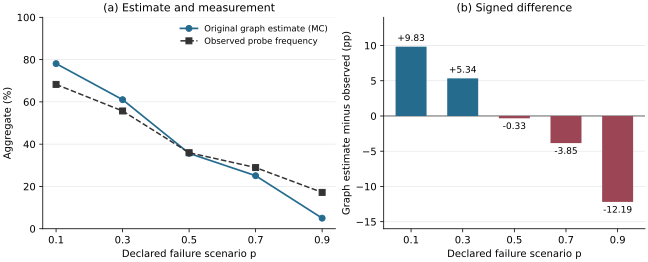

Draft for review. Independent main run 34465226083 is registered; its audited interpretation must be integrated before submission.

Historical audits, technical checks, mechanism evidence and independent comparison have separate scopes. The original source chapters and complete claim table remain part of this draft.

## Introduction

A service dependency graph makes an appealing starting point for availability analysis. It can be recovered from distributed traces, connected to replica information, and evaluated under a declared failure law. The resulting model is explicit enough to inspect and inexpensive enough to consider before repeatedly deploying a fault experiment. The difficult question is what its success predicate means. A path to a live replica does not establish that the request selects that replica, completes every required action, meets its deadline, or produces the required business result.

The author's ICSE work introduced artifact-driven model discovery and evaluated a connectivity model on DeathStarBench. The subsequent AINA study examined endpoint-specific predicates and the immediate role of asynchronous edges in the OpenTelemetry Demo. These studies supply the empirical starting point of the present investigation, rather than independent evidence for its new method. The ICSE paper is published in the 2026 NIER proceedings; the AINA preprint and published chapter have different titles and are cited separately where their versions matter. [Krasnovsky, ICSE](https://arxiv.org/abs/2506.11176v2); [AINA preprint](https://arxiv.org/abs/2512.12314v1); [AINA published chapter](https://link.springer.com/chapter/10.1007/978-3-032-23304-2_24).

Re-examining the retained results sharpens the question. The AINA aggregate graph estimate exceeds observed probe success by about 9.83 percentage points in the lowest declared failure scenario, but is about 12.19 points below it in the highest. The sign change survives arithmetic reconciliation of the original archives. Conversely, exact evaluation shows no difference between the two graph predicates over their original allowed state class. Equality between two model variants therefore coexists with disagreement between those models and observation. The historical experiment does not, by itself, identify the mechanism causing that disagreement. Its timing and runtime provenance impose additional limits. The [results chapter](../ARTICLE_RESULTS_V3.md) reports these distinctions and the ICSE audit without substituting present-day business-operation measurements for the original endpoint contracts.

The main contribution is a method for automatically constructing and identifying a formal stochastic availability model of microservice operations from telemetry. The method preserves joint within-attempt observations and explicitly determines which target probabilities those observations identify. Its central chain is formal model, automatic construction and identification, and a justified point estimate or attainable bounds within the declared model class. Semantic criteria for when a simpler topology model suffices are consequences of this method and its specification.

Three questions guide its assessment. Under what assumptions does reachability equal successful execution? Which execution functionals are identified by the observations available to the model builder? Does the resulting forecast agree with separately observed business outcomes, and at what computational cost? These questions require distinct evidence. A correct graph solver may evaluate a functional that is ambiguous under the observation contract or an execution event that still differs from external business success.

The proposed model makes these distinctions explicit. It combines an operation graph, replica bindings, a joint law of request-aligned observations, and an execution predicate. The state records proxy eligibility, the joint footprint selected by mandatory calls, completion observations and the external deadline. An observation may leave several state coordinates unknown. Rather than assign an independent failure factor to each coordinate or fit a residual success term, the identification procedure retains the complete masked category of every calibration attempt. It computes exact attainable bounds for each requested functional and emits a point only when the bounds coincide under that observation contract.

The method has three connected parts. First, this work introduces a formal stochastic availability model linking the service graph, replica states, actual replica selection, mandatory-call completion, the operation deadline and incomplete observations. Second, the implemented construction identifies graph structure and probabilistic functionals from permitted traces, replica observations and the complete attempt census, retaining failures and missing coordinates. It uses joint frequency counts and exact probability calculations, without machine learning, under explicitly authored operation contracts and telemetry interpretation rules. Third, the justification gives point-identification conditions, attainable bounds under incomplete observation, and an exact reduction of completion-state enumeration for the declared class. These parts form the unified model-construction and identification contribution. The indicator identities and finite-state bounding arguments used in its justification are established mathematical tools. The [claim table](../ARTICLE_CLAIMS_V3.md) records the evidence for each part and its relationship to other research.

An earlier version of this work is the [stochastic-connectivity preprint by Krasnovsky and Maslovskaya](https://arxiv.org/abs/2607.00740v1). The present article develops its formal model, automatic identification method and empirical evaluation.

The experimental evaluation tests this model-to-identification-to-estimate chain. H-EXEC holds a replica pause fixed while changing routing, establishing a scoped failure mechanism for the declared checkout operation. It motivates examining selection and execution guards, but does not retrospectively explain the AINA biases. Technical application checks establish that the native graph actually enters calculation and that saved models replay exactly. The independent comparison assesses accuracy, point and interval support, and computational costs for the selected model, its guard ablations, a source-adapted earlier graph estimator, raw calibration frequency and independent PMX/Palladio forecasts. Its three applications, ten external operation contracts and complete attempted census are specified before opening main test outcomes. Its main findings remain pending. Error reduction against a comparator would support practical usefulness; the proposed method and its identification guarantees are the central contribution being evaluated.

## Related work and the remaining question

### Identification from indirect observations

Network tomography provides direct precedents for recovering internal quantities from path observations. Bu, Duffield, Lo Presti and Towsley connect path-success measurements to link parameters under explicit assumptions; Duffield further explains ambiguities in marginal path measurements and the information available in correlated measurements. These works prevent treating path products, algebraic rank or shared-path ambiguity as inventions of the present study. The difference in our final model is the declared request-level execution event and the use of a joint masked state law; it is not a new general inverse-problem principle. [Bu et al.](https://nickduffield.net/download/papers/Bu_tomography_02.pdf); [Duffield](https://nickduffield.net/download/papers/D06-binary.pdf).

Identification of the parameters of a model also differs from identification of the target that a user needs. In the present finite observation fibers, a requested functional may be constant even when some coordinates remain unknown. Conversely, a discovered graph and a complete denominator need not identify its execution probability. Sharp bounds express this distinction without assuming that a missing completion observation is independent of failure. Probability bounds over feasible state laws have established linear-programming predecessors; the present reduction is a checked specialization to its completion-conjunction class. [Prékopa](https://pubsonline.informs.org/doi/10.1287/opre.38.2.227); [Boros and Lee](https://arxiv.org/html/2110.10672).

### Extracted architectural and reliability models

PMX/Palladio is a relevant independent comparison because it supplies an extraction-to-prediction path, rather than another instance of the present graph estimator. The report by Weber, Weber and Henß describes combining performability-model extraction with prediction in a continuous-delivery setting. Our experiment therefore evaluates the identified native-operation/PCM chain and its solver, with its actual mapping policies, completion/error conventions and manual adaptations disclosed. Failure of an unrelated extraction route would not evaluate this comparator. A failure in the pinned adaptation also does not establish a limitation of the entire PMX/Palladio ecosystem. [Weber et al.](https://fb-swt.gi.de/fileadmin/FB/SWT/Softwaretechnik-Trends/Verzeichnis/Band_45_Heft_1/SSP24_26_camera-ready_8969.pdf).

Automated architectural maintenance and calibration have substantial prior art. CIPM updates architectural performance models after software, runtime and usage changes and combines parameter calibration with adaptive monitoring and validation. Its evaluation addresses accuracy and resource costs. Consequently our automation claim is restricted to what the present implementation automates under its declared inputs; it does not claim to introduce architectural calibration or validation. Its business-availability outcome and measurement design also do not import CIPM's reported overhead results into these applications. [Mazkatli et al.](https://link.springer.com/article/10.1007/s10515-025-00521-9).

Process-mining reliability research similarly combines event and resource-state information with process and failure models. Friederich and Lazarova-Molnar's 2022 paper specifies such an extraction and parameterization path. Their later article in SIMULATION occupies the broader data-driven reliability lifecycle, although the earlier review obtained only its abstract and metadata. We therefore do not infer the absence of detailed identification guarantees from that abstract. These predecessors establish the need to state exactly which observations, execution assumptions and calculation guarantees distinguish the present application class. [2022 full paper](https://informs-sim.org/wsc22papers/254.pdf); [SIMULATION article](https://journals.sagepub.com/doi/10.1177/00375497241302866).

### Purpose-specific validity and systematic simulation tests

Purpose-specific adequacy already has formal precedents in Simulation Modelling Practice and Theory. Foures, Albert and Nketsa combine a system model with its experimental frame to assess whether simulation scenarios support the intended purpose. Their input/output-automata approach makes model/context compatibility explicit. Our Boolean simplification condition addresses a narrower probability target, while masked-law identification concerns what telemetry determines; neither replaces the broader experimental-frame viewpoint. [Foures et al.](https://www.sciencedirect.com/science/article/abs/pii/S1569190X16000411).

Hollmann, Cristiá and Frydman derive simulation-configuration classes from mathematical DEVS specifications to guide systematic validation. Their selection relies on a uniformity hypothesis within each class. Our reduced enumeration has an exact guarantee within its finite completion-conjunction class; application adequacy instead requires the separately measured outcome. Systematic controls, formal calculation and empirical validation therefore retain distinct evidential roles. [Hollmann et al.](https://sce.carleton.ca/faculty/wainer/papers/1-s2.0-S1569190X14001142-main.pdf).

### Transport and the scope of a forecast

A model identified in one environment does not automatically identify a forecast after a placement change. Reweighting requires assumptions connecting source and target laws; covariate-shift methods explicitly separate changing exposure from a stable conditional response relationship. Our source-only procedure assumes no such relationship for the changed joint execution law, and consequently returns no target point. This explicit lack of transport support is part of the evaluation, not an invitation to fit on target outcomes and call the result a transfer forecast. [Sugiyama, Krauledat and Müller](https://jmlr.org/papers/v8/sugiyama07a.html).

Across these lines, the remaining question is narrower than whether telemetry can produce models. It is when an explicit, automatically identified model has enough semantic and observational support for the requested availability claim, and what a controlled independent comparison establishes about that support. The present study answers the formal and implementation parts for a declared class; its empirical generalization is bounded by the completed mechanisms, the tested operation contracts and the actual support of the prospective comparison.

## Methods

### 1. Estimand and unit of observation

An external attempt is one invocation of a declared business operation. Its outcome Y is one only if the complete externally timed request sequence satisfies its response/content contract before the two-second deadline and its operation-specific auxiliary assertions pass. The deadline begins before the first HTTP request and includes prerequisite requests, response bodies and inline semantic checks. A multi-request checkout is one attempt, not several independently scored requests. Every attempted invocation has one request identity and one propagated trace context; failed, timed-out and untraced attempts remain in the denominator. Drivers neither retry the business operation nor follow redirects. The [ten operation contracts](../TEN_EXTERNAL_OPERATION_CONTRACTS.md) state the exact assertions and the limits of each success claim.

For a current campaign, the target is the success probability of a future attempt drawn under that campaign's declared workload and environment. Calibration data precede a separately sealed test period. The observed test proportion estimates the target on that period; neither model output nor a successful probe defines Y. For example, an accepted DeathStarBench post is not a proof of durable storage, and checkout does not establish external payment or delivery. Petclinic visit creation additionally uses a deferred independent SQL census. That audit is outside the response-time measurement: finding the record later neither establishes its exact commit timestamp nor changes an original deadline failure into success. Consequently this endpoint must not be described as independently proving a database commit before the client deadline.

The comparison uses three applications and ten operations, two declared placements and four failure-law conditions. A campaign is the independent experimental and resampling unit. Requests within a campaign may be dependent. Source-only prediction after a placement change is a different estimand, for which the current implementation does not identify a target probability.

### 2. Formal object and provenance of its parts

The formal model introduced in this work is $M=\langle G,R,P,\Phi\rangle$. $G$ is an operation-specific graph of observed service and database relations. $R$ binds logical replicas to eligibility gates. $P$ is a joint state law compatible with the observations. $\Phi$ is the operation predicate. The observation contract, including masks, specifies what can be identified from telemetry. The contribution is this model with its construction and identification method, rather than the tuple notation by itself.

The [Krasnovsky–Maslovskaya preprint](https://arxiv.org/abs/2607.00740v1) is an earlier version of this same work. Its Sections 4–5 describe the typed graph, replication map, state measure and request predicates with a product-law baseline. The present article completes the model's request-level execution and observation specification and its implemented identification method: selected replicas, completion and timing belong to one joint law, masked observations define compatible laws, and replica bindings record eligibility gates. The implemented scope is the explicit class below, not every distribution or eventual-completion predicate expressible by the notation. The retained earlier manuscript and reference code keep their distinct version [byte provenance](../evidence/original-formalism-map-2026-09-08/paper-provenance.json).

The main model does not assume independent primitive failures. Its state comprises X, the last observed eligibility of controlled replicas; D, the joint footprint of replicas selected by mandatory target calls; C0, entry protocol completion; Cg, completion of each mandatory call group; and T, completion within the external deadline. Coordinates describe an attempted execution, including dependence induced by routing and observation. A completion coordinate is not the counterfactual capability of an unselected replica.

| Model object or parameter | Observation or declaration | Implemented rule | Scope and unresolved information |
| --- | --- | --- | --- |
| G: service nodes and edges | Whitelisted native span service, span/parent identifiers, native kind and declared boundary context | Extract cross-service parent relations; aggregate repeated observed relations while retaining support counts | Unseen branches are not recovered; missing source-required relations produce unsupported output |
| G: database peers | Native CLIENT spans and system/address/port/database identity | Bind explicit peers, or complete a missing field only under a unique source-backed peer declaration | A synthetic peer is not a native database SERVER span or a separate physical state process |
| Required nodes and call groups | Versioned source inspection and external operation contract | Bind each declared mandatory group to a discovered synchronous edge | Mandatory status is not inferred merely because a call appeared; source-contract authoring is manual |
| Optional work | Source-declared ignored error paths and actual parent chains | Exclude optional calls and their descendants from mandatory completion/selection requirements; retain their elapsed time in T | Unclassified retries, recovery from failed mandatory calls and unseen branches are outside the declared class |
| R and target identity | Declared target service/replicas and native host identity | Map selected target instances to a or b; store explicit gate bindings | Two logical domains may share one runner; this is not a physical multi-host placement claim |
| X | Request start and timestamped proxy checks | Use the latest completed check at or before start, at most two seconds old; decode the declared L4 or L7 contract | Stale/absent/unknown checks are masked. Eligibility is a proxy, not physical capability |
| D | All mandatory target entries of one external attempt, with native replica identity | Record the joint demanded-replica footprint, including repeated calls and both-replica paths | Incomplete identity/entry evidence is masked; no independent routing probabilities or imputed selections |
| C0 | Explicit native entry protocol/error certificates and declared external-root count | A certified failure makes the conjunction false; success additionally requires the expected root census | An absent error flag is not a success certificate; protocol completion is not full payload correctness |
| Cg | Native mandatory-call records, explicit failures and declared source error propagation | Use certified failure/success; source-propagation completion requires its declared observation/count conditions | Otherwise masked; cached/conditional and optional branches retain their explicit declarations |
| T | External request start/completion timestamps and fixed two-second deadline | Compare whole-operation elapsed time with the deadline | No response-time distribution or residual failure factor is fitted |
| P / empirical observation law Q | One masked X/D/C/T row for every calibration attempt | Count complete masked categories jointly, with exact integer denominators | No coordinate independence, MCAR assumption or identification of physical failure causes |
| Non-target eligibility | Explicit model scope declaration | Fix non-target node eligibility to true | This is a declared simplification, not an estimated availability parameter |
| B0's probability | External calibration semantic verdict on every attempt | Raw S/N, without smoothing | This input is intentionally richer in business outcome labels than Gstar's parameter observations |

The field whitelist and physical role files are specified in [ordinary identity v2](../V3_ORDINARY_IDENTITY_V2.md). The source-bound adapter and its corrections are specified in [application execution v2](../V3_APPLICATION_EXECUTION_V2.md). The prospective wrapper preserves the qualified numeric identification/solve path, while changing campaign identity, expected calibration census and stage timing. It does not tune an unexplained q from semantic labels.

### 3. Execution semantics and the exact simplification condition

Let $B(s)$ be synchronous reachability of every declared required node in state $s$. For each controlled service $v$, let $D_{vr}$ indicate that replica $r$ is demanded by a mandatory call, and let $A_{vr}(s)$ be the conjunction of that replica's eligibility gates under $R$. Define

$$
R_{\mathrm{sel}}(s)=B(s)\land
\bigwedge_{v}\left[
\left(\bigvee_r D_{vr}(s)\right)\land
\bigwedge_r\left(\neg D_{vr}(s)\lor A_{vr}(s)\right)
\right].
$$

Thus each controlled service must have at least one demanded replica, and every demanded replica must have all its eligibility gates true. Both replicas may be demanded within one attempt; there is no exclusive-choice or independent-routing assumption.

Let $C(s)$ be $C_0$ conjoined with every required $C_g$ and the presence of each bound required synchronous edge. Define $E(s)=R_{\mathrm{sel}}(s)\land C(s)\land T(s)$. A missing required edge makes completion false even if an alternative path reaches the same service. Optional synchronous work and asynchronous work are not automatically prerequisites of immediate business completion. This is a declared immediate-completion class, not a model of eventual completion.

The implemented graph functionals are $B$ (GID), $R_{\mathrm{sel}}$ (Gselected), $E$ (Gstar), $R_{\mathrm{sel}}C$ (without deadline), $BCT$ (without selection), and $R_{\mathrm{sel}}T$ (without completion), where multiplication denotes Boolean conjunction. All use the same discovered model and joint observation law. Thus a difference between two of these functionals isolates a mathematical guard in this model; it does not by itself identify a real-world causal mechanism.

**Semantic statement.** For every complete state, $E\leq R_{\mathrm{sel}}\leq B$, and $E$ is no greater than any of its three single-guard ablations. For every law $P$,

$$
\mathbb{E}_P[B]-\mathbb{E}_P[E]
=P\{B=1,\ E=0\}.
$$

Consequently reachability and execution give the same mean exactly when P(B = 1, E = 0) = 0. They agree for every law supported on a set S exactly when B = E at every state in S.

**Proof.** E is obtained by conjoining additional Boolean requirements with B. Hence B-E is the indicator of B=1 and E=0; integration gives the identity and its almost-sure equality condition. Pointwise equality on S is sufficient for every supported law. If equality fails at any state in S, a point mass at that state violates equality, proving that pointwise equality is necessary. These are elementary indicator facts, not a new general probability theorem.

For a concrete strict inequality, consider one controlled service with replicas a and b. Replica a is eligible and b is not, but the request demands only b. Then $B=1$ and $R_{\mathrm{sel}}=E=0$, even if all other guards are true. Similarly, $R_{\mathrm{sel}}=C=1$ with $T=0$ distinguishes execution from the variant that omits the deadline. These are complete-state counterexamples to removing the corresponding guard without an assumption excluding such states.

The condition connecting this model to measured availability is additionally Y=E almost surely within the workload/environment class. It requires correct source propagation and call-group completeness assumptions, correct content/fixture assumptions, an adequate external timing boundary, and eligibility that is necessary for the actual execution despite probe lag. The model does not establish these assumptions by observing a successful span. A stale DOWN check can coexist with successful execution; a protocol-successful response can contain corrupt required content. Both are counterexamples to automatic business equivalence. In particular, the sign of B-Y is not constrained by the preceding identity.

The [H-EXEC experiment](../milestones/H_EXEC_01_SEALED_STUDY_CONFIRMATION.md) supplies an independent, scoped routing/execution mechanism check. It does not establish every business-equivalence assumption or explain the historical AINA biases. Only this one deep mechanism is selected; the three ablations are not presented as three additional causal hypotheses.

### 4. Identification under informative missingness

Each calibration attempt contributes a category o consisting of its observed Boolean values and mask. Let Q(o) be the observed category frequency and F(o) the compatible complete states. A compatible full law chooses any conditional distribution supported on F(o) for each category. The completion of a mask may depend on the state and the mask; there is no missing-at-random restriction.

For a Boolean functional f, the sharp identified range conditional on the empirical Q is

$$
L(f)=\sum_o Q(o)\min_{s\in F(o)}f(s),\qquad
U(f)=\sum_o Q(o)\max_{s\in F(o)}f(s).
$$

**Proof.** Within each category, every compatible conditional expectation lies between its minimum and maximum. Weighted summation yields the stated bounds. Selecting a minimizing or maximizing state separately in each positive-frequency category attains the respective endpoint. Therefore the bounds are sharp. The range is a singleton exactly when f is constant on every positive-frequency fiber. This finite-fiber argument is standard partial identification; the contribution here is its explicit observation contract, graph-execution binding and checked implementation.

A target can be point identified while some latent coordinates remain unidentified. Conversely, a graph with many observed edges need not identify its target. Ambiguity is reported as a null point with bounds, not a midpoint or fabricated zero. A paired gap is evaluated as one functional on a common state; subtracting independently attained marginal endpoints would generally answer a different question.

The exact solver enumerates the masked X/D/T control coordinates, with at most ten declared control bits. Conditional on those values, every reported functional and paired gap is affine in the single Boolean conjunction C. Replacing all masked completion bits by false or by true attains its feasible endpoints, so at most two completion candidates per control assignment suffice. These candidates are actual members of the fiber. This proves equivalence to exhaustive enumeration within the implemented class. Counts and probabilities use exact rational arithmetic. No Monte Carlo or ML is used for identification or graph prediction.

**Identification algorithm.** The source declarations and permitted calibration-role files are inputs; the serialized graph model, category counts, functional bounds and point/refusal statuses are outputs.

1. Extract the observed graph, bind required edges and replica gates to the source declarations, and validate every structural binding. A missing or ambiguous required binding returns an explicit unsupported status.
2. Form one masked X/D/C/T row per calibration attempt and count identical rows. With $N$ attempts and category count $n_o$, store $Q(o)=n_o/N$ exactly; do not discard incomplete rows.
3. For each category, enumerate its unknown control bits and the feasible completion extremes. Evaluate each functional and each paired gap on the same complete candidate state. If the category has $k_o$ unknown control bits, this requires at most $2^{k_o+1}$ candidate states, where $k_o\leq10$.
4. Accumulate the weighted minimum and maximum for each functional. Return the common value only when its two exact bounds coincide; otherwise retain the interval and a null point.
5. Serialize the discovered structure, bindings, counts and results, then reproduce the calculation in a separate process before sealing the forecast for later evaluation.

The candidate bound concerns the finite solver after extraction; it is not a runtime bound for acquiring telemetry or integrating an application. It also does not imply that every recorded coordinate is identified. For example, in a simple reachable graph, a category with known $T=0$ and all other coordinates masked fixes $E=0$ while $B$ can still range over $[0,1]$. Removing a guard can therefore destroy point identification. The solver returns that ambiguity instead of imputing the missing states.

The implementation checks at most 64 coordinates and rejects unsupported control dimensions. Artificial controls compare the reduced solver with exhaustive enumeration of every masked category in a small model, exercise known outcomes and informative masking, and verify structural changes and equivalent representations. Saved-model replay occurs in a fresh process. These checks establish arithmetic and dependence on the model structure, not population confidence coverage or adequacy for Y.

Q estimated from a finite calibration sample is not the population observation law. Forecasting a later period also assumes invariance of the relevant law. Identification bounds, calibration sampling error, between-campaign uncertainty and semantic misspecification are distinct. The earlier independent-primitive/monomial identification results belong to their own restricted model class and are not silently transferred to this joint execution estimator.

### 5. Comparators and information access

The [frozen method table](../V3_FINAL_COMPARISON_BINDINGS_V1.md) defines all ten outputs before main acquisition. G0 is an explicit adaptation of the original AINA fixed-k graph algorithm. It uses the observed graph and the all-attempt mean failed-eligibility fraction, including mask bounds, but not D, C, T or semantic outcomes. Its source quantization is preserved. This adaptation must not be described as an unchanged reproduction of AINA's original experiment. B0 is the unregularized calibration semantic-success frequency.

PMX is a separate native-telemetry-to-PCM-to-Palladio chain. The primary variant is `conditional_local`; inclusive failure composition is reported separately. An unsupported primary PMX point is retained as such and is never replaced by the inclusive prediction. PMX receives a physically separate copy of the same whitelisted native spans and external calibration requests, including calibration failure labels, but receives no proxy health, our discovered graph, our fitted parameters or target-test inputs.

The PMX input mapping is fixed per application: service boundaries for DeathStarBench, explicit SERVER spans for OpenTelemetry Demo, and SERVER plus observed MySQL CLIENT peers for Petclinic. In OpenTelemetry Demo, database execution remains aggregated within the enclosing SERVER; it is not an extra PCM peer. Petclinic database CLIENT peers are observed call abstractions, not measured database SERVER state processes. Caller-context separation, failure containment and integer-PMF bridges are declared adaptations. Four known-probability context/database cases, two variants and two solver passes provide 16 oracle records in each application solver batch. The prospective v3 chain uses a disclosed, SHA-pinned clock-progress correction to the author PMX binary: a zero or nonrepresentably small step advances by max(1 ns, one double ULP), while original interval endpoints and observations are preserved. Its [matched development qualification](../milestones/PMX_CLOCK_PROGRESS_QUALIFICATION_V1_RESULT.md) preserves all 32 previously supported forecasts and resolves one timed-out projection; it does not supply independent test accuracy. Derived-binary compilation is recorded separately from extraction and solving. Application forecasts require valid probability mass and agreement between repeated solves. A failed oracle invalidates the corresponding application batch.

These differences form an information-access comparison, not a claim that every method estimates the same state parameters from identical fields. The external target Y, campaign identities, calibration/test separation and error analysis are shared.

### 6. Prospective procedure, census and analysis

The frozen design has 3 applications x 2 placements x 4 laws x 10 repetitions = 240 main campaigns. There are 800 operation cells per method and 8,000 planned current-prediction slots across ten methods. Each campaign schedules 60 seconds of baseline, 900 seconds of calibration and 900 seconds of test at four attempts per second, with declared recovery intervals. The preflight has six campaigns, one per application/placement at NCD and repetition zero, in a separate namespace and seed. It uses the same durations but does not enter the main sample.

Acquisition writes separate ordinary-calibration, PMX-calibration and closed-evaluator roles. Estimators receive only their input roles. Graph outputs must replay exactly from the saved model in a separate process. Candidate freezing associates all method slots with the calibration seals and expected evaluator seal. The evaluator job verifies the frozen role before downloading its closed test role, then opens that role and computes outcomes without fitting. File hashes establish byte integrity and association; fresh jobs and audited permitted reads supply operational isolation. Hashes alone are not a claim of adversarial confidentiality.

Qualification uses the declared acquisition census, readiness/baseline criteria, identity/provenance checks, independent solver controls and valid result statuses. Forecast error and superiority are never admission criteria. Missing jobs, unsupported models, malformed observations, missing evaluators and ambiguous functionals remain in the planned census. The full preflight must establish the complete procedure before the separately recorded main admission.

Primary accuracy uses every qualified test attempt. Per-cell signed error, absolute error in percentage points and Bernoulli Brier score are calculated from the frozen probability and test counts. Results report each method's own support and paired common support. The six primary contrasts are Gstar minus G0 and Gstar minus primary PMX MAE, separately for three applications. The [analysis component](../V3_CAMPAIGN_ANALYSIS_COMPONENT_V1.md) fixes equal-operation/equal-retained-condition aggregation and paired whole-campaign bootstrap within conditions, with 10,000 draws and nominal Bonferroni-adjusted 99.1667% intervals. These intervals are conditional on retained common support and are not a finite-sample familywise-coverage guarantee. One cluster permits a descriptive point only; an empty contrast remains null.

A secondary stable view uses the unchanged forecast on test attempts bracketed by unchanged, known proxy states over the declared guard interval, with a maximum observation gap. It reports retained fractions and empty subsets. It neither replaces the all-sequence primary result nor excludes failures merely because replicas are DOWN.

For every planned source-to-other-placement direction, the current implementation reports transfer as unsupported: null target point/error, unrestricted target-event bounds [0,1], and change bounds relative to a source point where available. Observed target outcomes and changes are opened only for evaluation. These no-information bounds are neither useful transfer forecasts nor confidence intervals. The zero point-coverage result is an explicit limitation, not an omitted experiment or a refit advertised as transport.

### 7. Cost, reproducibility and limits of automation

The remote jobs measure available extraction, identification, solve and replay durations, together with process wall/CPU time, peak RSS and artifact bytes. Shared acquisition and graph extraction are counted once; application-batch PMX solver resources are deduplicated. Overlapping stage and process totals are not summed. Historical integration labor, update costs without a measured update run, monitoring off/on overhead and scalability curves remain unknown rather than zero. No speed, overhead or scalability claim follows from a timed technical qualification alone.

Automation starts from a pinned application deployment, external workload/contract, instrumentation and source-bound declarations. Native graph extraction, joint-category identification, supported functional calculation, replay and evaluation are automated under these inputs. Selecting operation semantics, checking source error propagation, declaring peer completion and specifying workload assertions require manual work. The artifact must expose these actions and fields; it must not call the entire integration process fully automatic.

Every correction after an experimental dispatch receives a new version and retains the previous outcome. Frozen source/configuration hashes, native-byte seals, role read audits, compact reports and complete attempted censuses link claims to executions. Full native/model payloads remain in remote evidence storage; only explicitly allowlisted compact artifacts are retained locally. Technical success, mechanism evidence, calibration adequacy and independent predictive validation are reported separately. The [claim-to-evidence table](../ARTICLE_CLAIMS_V3.md) records which publication claims are already supportable and which await the prospective results.

## Results

### 1. Historical discrepancies survive arithmetic and provenance checks

The historical ICSE and AINA studies motivate the adequacy question, but they use their own endpoint/measurement contracts and failure designs. Their observations are not relabelled as the present ten whole-business-operation outcomes. Reproducing their aggregate arithmetic is also distinct from reconstructing every original runtime condition.

For ICSE, 250 retained job rows and 750 accompanying scalar JSON records agree, and all 40 printed mean/standard-deviation cells reproduce at the published four-decimal precision. The audit preserves the difference between percentage-point and relative error. For example, with replication at scenario p = 0.3 the signed mean difference is approximately -0.00124 percentage points, while mean absolute error across 25 jobs is 0.15884 percentage points. Cancellation of signed differences therefore does not establish equality of individual predictions. When both observed and predicted values are zero, relative error 0/0 remains undefined. The reported 112,500 windows cannot be independently reconstructed from the surviving scalar means: raw window denominators and the exact 250-job execution provenance remain unavailable. A surviving 20-job rerun is not substituted for that source. These results and limits are recorded in the [ICSE aggregate audit](../milestones/ORIGINAL_ICSE_AGGREGATE_AUDIT.md).

For AINA, all 250 nested original archives match the retained provider digests. The audit reconciles 25,000 windows and 2.5 million probes, including exact success/attempt counts. The original aggregate calculations reproduce to floating-point precision. Nevertheless, the discrepancy between the original graph estimate and observation changes sign and remains substantial at both extremes of the declared scenario parameter.

| Original scenario p | Original graph estimate, all-block MC | Observed probe frequency | Signed difference, pp |
| --- | ---: | ---: | ---: |
| 0.1 | 0.780945236 | 0.682630 | +9.831524 |
| 0.3 | 0.610407776 | 0.557032 | +5.337578 |
| 0.5 | 0.356400884 | 0.359702 | -0.330112 |
| 0.7 | 0.250870400 | 0.289356 | -3.848560 |
| 0.9 | 0.050005696 | 0.171918 | -12.191230 |

*Figure 1. Recomputed original AINA aggregates from the retained five-scenario summary. The left panel contrasts the original Monte Carlo graph estimate with observed probe frequency; connecting segments guide the eye between the five scenarios. The right panel shows their signed difference in percentage points. These are descriptive historical aggregates, not v3 business-operation validation or a causal decomposition. No inferential error bars are implied. The original fixed-cardinality quantization of p is preserved. The [vector SVG](../figures/aina-audit-v3.svg), [source/provenance and exact values](../figures/aina-audit-v3-provenance.json), and [rendering script](../../scripts/render_article_aina_figure_v1.py) preserve this figure's derivation without processing raw traces or rerunning a model locally.*

The original global graph estimate gives equal weight to the four endpoint estimates; the separately retained realized-endpoint-mix diagnostic is not substituted here. Signed aggregate differences in this table are not per-window MAE. The [full AINA audit](../milestones/ORIGINAL_AINA_FULL_AUDIT.md) additionally checks the original graph simplification exactly. Across 20 distinct graph/replica byte pairs and all 32,768 allowed failure states per pair, the asynchronous and all-block predicates differ on no endpoint state. This is 655,360 pair/state controls under the source's declared failure universe, rather than a nonsignificant comparison of sampled predictions.

The exact global probabilities agree in both modes: 82/105, 1111/1820, 139/390, 137/546 and 1/20 at the five scenarios. This invariance does not validate the live model, since both equal graph predicates can disagree with measurement. Nor does it reproduce the literal published numerical bound of at most 0.001 percentage points for every retained Monte Carlo difference: the largest retained global difference is approximately 0.0053024 percentage points, and an endpoint difference reaches approximately 0.0068896 percentage points. The exact semantic result and finite Monte Carlo outputs must be distinguished. The retained Monte Carlo errors are compatible with the audit's stated simultaneous numerical bound; no new Monte Carlo draws were added to replace the originals.

A separate [timing-feasibility audit](../milestones/ORIGINAL_AINA_TIMING_FEASIBILITY.md) examines the documented controller period, sequential probes and timeout configuration. Conditional duration lower bounds exceed the nominal 60-second controller period in 3,483 of 25,000 windows. These bounds indicate a measurement-alignment concern, but do not reconstruct actual per-probe times or establish exact fault overlap. Original application images/runtime identity are not fully pinned. The discrepancy is reproducible as an observation; its historical cause is not established by these checks.

### 2. One independently controlled routing mechanism

H-EXEC tests a specific mechanism on the declared OpenTelemetry checkout operation. Each of eight blocks contains fresh deployments under sham, transition, settled and repaired conditions. In the settled condition, replica a remains paused while b remains available; the repaired condition retains the pause and removes a from routing. The test concerns execution under that routing policy, rather than using prediction error alone to infer a cause.

The final immutable-input audit qualifies all 32 study cells, retaining 15,360 business attempts across the full recorded periods. The measured test periods contain 3,840 business attempts, including 1,280 checkout attempts, and 480 static controls. All originally retained request rows and statistics remain unchanged.

| Registered co-primary checkout contrast | Mean block difference | Exact two-sided label-swap p | Registered decision |
| --- | ---: | ---: | --- |
| Sham minus settled | +100 pp | 0.0078125 | Passes alpha = 0.025 and the 5 pp minimum-effect condition |
| Repaired minus settled | +100 pp | 0.0078125 | Passes alpha = 0.025 and the 5 pp minimum-effect condition |

Every measured settled checkout attempt fails and selects a: 320/320 across the eight blocks. All 320 repaired attempts and 320 sham attempts succeed. Thus the availability of a live alternative is insufficient for this whole operation under the tested selection policy, and the declared routing intervention restores success within the experiment. Static controls succeed 120/120 in each arm. Their observed stability is not a statistical equivalence claim.

Both primary contrasts have eight identical block differences of one. The registered 10,000-draw paired-block bootstrap therefore returns the degenerate 97.5% display interval [1, 1]. This does not prove an exactly 100-point population effect or guaranteed finite-sample confidence coverage. Browse/cart diagnostics remain secondary and do not replace a primary result. The [H-EXEC confirmation](../milestones/H_EXEC_01_SEALED_STUDY_CONFIRMATION.md) supplies complete block, route and static-control evidence.

The initial study gate qualified 31/32 cells because one native-parser cleanliness check failed. A separately versioned replay on the final immutable uploaded inputs qualified the remaining cell while preserving all request outcomes and inferential results. A concurrent append is a plausible explanation for the original parser failure, but the precise bytes observed at that moment were not retained. This repair is evidence about input integrity, not another independent experiment or an extra block. The result supports one scoped mechanism; it neither identifies a mediation fraction nor explains the historical AINA bias. The [mechanism status record](../V3_MECHANISM_STATUS.md) gives the explicit evidence and limits for every initial candidate explanation; a second controlled mechanism is not required by the v3 scope.

### 3. Model-derived forecasts are technically reproducible

The ordinary-observation identity qualification links native host identity, external request context and the declared replicas, while preserving the external-attempt denominator. Source inspection declares required and ignored call groups; their runtime graph relations are still extracted from observed native spans. This division matters: source semantics do not license a replacement graph template, and a recorded call does not alone establish that it is mandatory.

The qualified execution binding v2 produces ten saved point models on 4,080 previously opened calibration attempts. Six ordinary inputs are read by each builder, and a separate process reproduces each saved-model calculation. Removing each of 44 bound required edges makes the relevant execution result zero; equivalent edge ordering preserves the complete result. Six operations unaffected by the preceding observation correction retain exactly the same numerical-result hashes. These checks establish that the discovered graph enters the calculation and that the saved model is sufficient for replay. They do not establish independent forecasting accuracy.

| Technical calibration operation | Joint reachability | Execution functional | Scope |
| --- | ---: | ---: | --- |
| DeathStarBench compose/home/user timeline, each | 1 | 1 |80 opened normal attempts per operation |
| OpenTelemetry browse/cart/checkout, each | 1 | 1 |80 opened normal attempts per operation |
| Petclinic list owners / list vets, each | 1 | 1 |900 opened attempts per operation; declared fixture/cache scope |
| Petclinic create visit |781/900 |728/900 |900 opened attempts; declared L7 eligibility and persistence audit |
| Petclinic owner details with visits |17/20 |714/900 |900 opened attempts; full declared fixture |

The [execution qualification report](../milestones/V3_APPLICATION_EXECUTION_V2_RESULT.md) retains real masks even where E is point identified. A known failed guard or deadline can fix the event while some entry, demand or database coordinates remain unknown. Accordingly some ablations are ambiguous although the full execution functional is a singleton.

The Petclinic calibration also exposes a semantic-adequacy limit. External semantic frequencies are 741/900 for create visit and 727/900 for owner details, exceeding the execution estimates by 13/900 in each case, approximately 1.4444 percentage points. These aggregate differences are not a count of 26 individually established false-negative requests or a causal attribution to one guard. The no-selection ablation changes the estimates, but does not prove a real-world mechanism for the residual discrepancy. No compensating q was fitted. The theoretical relation between B and E remains exact while its additional equivalence assumption Y=E is unestablished.

G0's separate [source-adapted qualification](../milestones/V3_G0_QUALIFICATION_V1_RESULT.md) supplies ten point forecasts, ten exact saved-model replays and 41 structural controls. Its fixed-k quantization and all-attempt eligibility-based parameterization are explicit. The earlier AINA probability law is not silently represented as an unchanged application of the new observation contract.

### 4. Full-duration preflight exposes coverage and an integration defect

The first full prospective-pipeline preflight, run `34442870952`, executes six development campaigns and retains all 200 planned current-method slots. All six acquisition/evaluator gates qualify, covering 21,600 test attempts. Seventeen execution models replay exactly. Gstar is point identified in 10/20 operation cells; seven cells have ambiguous identified ranges and three are unsupported because of an unexplained native parent boundary. GID and G0 have 17/20 points; B0 has 20/20. These coverage findings are retained, including every null point and reason.

All six application PMX projections fail before Java extraction because the new eight-field request role lacks the legacy adapter's per-row `profile` metadata. Both PMX columns therefore have 20 explicit missing forecasts. The independently prepared controls nevertheless yield 48 correct solver records across the three application batches. This separation demonstrates why positive solver controls and successful graph jobs are insufficient to declare the entire comparator integration qualified.

The [full preflight failure report](../milestones/V3_COMPARISON_PREFLIGHT_V1_RESULT.md) preserves the artifacts, traceback excerpts, qualified subchain and complete remote descriptive analysis. Graph/replay/evaluator reads are checked against their roles; candidates remain unchanged when all-sequence and stable outcomes are scored; all candidate-freeze jobs finish before the closed evaluator downloads. The global admission gate correctly remains false because application PMX forecasts are absent.

The [v2 correction](../V3_COMPARISON_V2_REQUEST_PROFILE_CORRECTION.md) derives the legacy wrapper's profile from the sealed campaign identity, preserves the eight-field input files and rejects extra fields. Exact-schema controls reproduce the original error and show equivalence to the qualified legacy projection with that metadata supplied explicitly. It changes no graph functional, native observation, PMX failure policy or outcome. Its full-duration preflight uses a new registered seed and namespace; v1 is preserved as failed development evidence.

#### Second full preflight: one explicit process timeout

The corrected run 34447262633 completes all 36 workflow jobs and resolves the request-profile interface. Nineteen of 20 operation projections qualify, but DeathStarBench split `read_user_timeline` reaches the frozen 1800 second PMX watchdog and exits 124 without a PCM repository. Both PMX variants for that cell are technical failures. The automatic admission check correctly rejects the main launch even though the provider shows a green workflow.

The [v2 failure record](../milestones/V3_COMPARISON_PREFLIGHT_V2_FAILURE.md) retains all 200 method slots, all 21,600 all-sequence test attempts and the exact missing forecasts. Primary PMX has 13 points, six valid conditional-local refusals and one technical failure; inclusive PMX has 19 points and one failure. Gstar has 10 points, eight ambiguous cells and two structural refusals. The successful subchain retains 48 known oracle solves and passes 1293 other strict provenance/replay/read-order checks. Those checks do not remove the failed admission gates. A separately declared exact-input process diagnostic follows; the cause of the nonterminating process is not inferred from its timeout alone.

#### Source-derived computational repair, separately qualified

Pinned-source and bytecode inspection plus an observer-only replay identify a zero-width overlap and zero LibReDE step in the timed-out case. A minimal representable-clock-progress correction preserves the original interval, samples and all other JAR members outside the factory class/source. The [matched qualification](../milestones/PMX_CLOCK_PROGRESS_QUALIFICATION_V1_RESULT.md) completes all 20 saved application projections and four controls. All 19 originally complete projections preserve every resolved field, including resource demands. The failed projection completes in 23.08 seconds including 20 seconds of startup. Seven builds yield the same derived JAR.

All 48 known solver-oracle records pass. The 32 previously supported forecasts remain exactly unchanged, six conditional unsupported slots retain null points/reasons, and two forecasts are recovered. No business test outcome is read in this repair qualification. These results establish a scoped computational repair on development inputs. The newly versioned full-duration preflight using seed 771605 subsequently passed its complete audit, as reported below.

#### Qualified full v3 preflight

The fresh full preflight, run `34460574221`, completes all 36 jobs in 49 minutes 25 seconds. Its [complete admission audit](../milestones/V3_COMPARISON_PREFLIGHT_V3_RESULT.md) qualifies all six campaigns, 200 method slots, 48 known solver-oracle records, all 20 PMX operation extractions, saved-model replay and actual data-read order. The retained package contains 28 compact archives, 167,051 bytes and 107 members, with no missing artifact. All 21,600 test attempts remain development evidence.

Technical qualification preserves the methods' valid refusals. Gstar supplies 12/20 points, GID and G0 18/20, B0 20/20, primary PMX 14/20 and inclusive PMX 20/20. Gstar has six masked-law ambiguities in OpenTelemetry Demo and two unexplained-parent structural refusals in DeathStarBench. Primary PMX retains six conditional-propagation/positivity refusals in OpenTelemetry Demo. No technical forecast failure remains. Low error and superiority played no role in admission.

#### Development accuracy does not isolate the execution contribution

The registered Gstar-minus-G0 MAE differences are -7.8333 pp for DeathStarBench and -6.1528 pp for Petclinic in this development package. The corresponding Gstar-minus-PMX differences are +0.4167 and +0.3809 pp. These are point descriptions with no interval: only one complete common DeathStarBench campaign and two Petclinic campaigns (one per condition) remain. OpenTelemetry has no estimable primary contrast. The DeathStarBench contrast averages its single complete three-operation campaign; a fourth common operation cell from an incomplete campaign remains in the census but does not enter that primary estimate. These results do not establish superiority, equivalence or independent main accuracy.

Comparing Gstar with G0 changes both the state-law parameterization and the execution functional. Their difference cannot identify the separate benefit of routing, completion or deadline guards. GID uses the same graph, replica bindings and joint masked law as Gstar but evaluates reachability. The guard ablations retain that common law while changing the declared functional. The following table copies existing per-cell errors from the retained [development comparison](../evidence/v3-comparison-preflight-34460574221/analysis/files/comparison.json); it adds no inferential contrast or calculation on raw application data.

| Application / placement / operation, NCD r0 | G0 absolute error, pp | GID absolute error, pp | Gstar absolute error, pp | Without selection absolute error, pp |
| --- | ---: | ---: | ---: | ---: |
| DeathStarBench / split / compose_post | 12.333333 | 12.083333 | 5.250000 | 4.750000 |
| DeathStarBench / split / read_user_timeline | 17.583333 | 17.083333 | 1.166667 | 0.500000 |
| Petclinic / colocated / create_visit | 17.555556 | 5.888889 | 0.000000 | 0.222222 |
| Petclinic / colocated / owner_details_with_visits | 17.666667 | 4.888889 | 1.444444 | 0.888889 |
| Petclinic / split / create_visit | 9.777778 | 1.000000 | 5.333333 | 4.666667 |
| Petclinic / split / owner_details_with_visits | 12.555556 | 4.111111 | 1.555556 | 0.777778 |

These are all six cells on their twelve-cell common point support with any nonzero error in the displayed methods. The other six common cells have zero error for all four methods: both DeathStarBench home-timeline cells and both placements of Petclinic list owners and list vets. The eight cells outside this common support remain explicit absences in the full census. No cell is omitted because Gstar loses.

The split Petclinic create-visit example is unfavorable to the execution refinement: GID error is 1 pp and Gstar error is 5.3333 pp. Removing the selection guard also lowers Gstar's error in five of the six displayed nonzero-error cells, while increasing it in colocated create visit. Thus the independently supported H-EXEC routing mechanism does not establish that this observation-derived selection guard improves every forecast. Eligibility measurements, execution certificates and external business success remain distinct. These development observations justify reporting the original ablations and their support; they do not authorize a method change after main dispatch or a causal explanation of the residual error.

### 5. Independent main: admitted, results pending

The 240-campaign main series was dispatched as [run 34465226083](https://github.com/a-a-k/telemetry-availability-identification/actions/runs/34465226083) on 10 September 2026 at 10:16:55 UTC, from source `d857ea65ca9da7fa9ae4ee1198317487475246a7` and tag `v3-main-771601-v3-admitted`. Exact-source CI 34465095817 passed. The [dispatch record](../evidence/v3-main-dispatch-v3.json) binds this independent series to the qualified preflight and fresh main seed 771601. Acquisition is active; the series has not yet supplied its final audited results. Consequently this chapter makes no Gstar-versus-PMX/G0 superiority or equivalence claim. Completed mechanisms, arithmetic audits, technical controls and development forecasts cannot substitute for the pending main results.

The final main section must report all 800 planned operation cells per method, support and absence reasons, own/common-support errors, the six prespecified paired contrasts, all-sequence/stable distinctions, source-only transfer coverage, measured stage/process costs and unresolved quantities. The reported source-only transfer procedure currently identifies no target point under an unrestricted changed joint law. That limitation must remain visible alongside current-campaign results, and target-calibrated rebuilding must not be relabelled as transfer.

## Discussion

### Assessing the claimed method

The central claim concerns automatic construction and identification of the declared formal stochastic model from telemetry, with justified target probabilities or attainable bounds. Its assessment therefore follows the complete chain: the extracted graph must affect the saved model's calculation; the observation contract must distinguish identified targets from ambiguity; the implementation must reproduce the stated exact calculation; and independent outcomes must establish the supported empirical adequacy, accuracy and computational costs. Conditions for using a simpler topology model are a consequence of that specification. Comparator error differences alone do not establish the entire contribution, and a low point-forecast coverage or uninformative interval remains a practical limitation of the method.

### What it means for the simpler model to be enough

The adequacy question has a semantic answer and an empirical answer. In the declared model, the execution event E implies synchronous reachability B. The exact simplification condition is that no positive-probability state has B=1 and E=0. This condition is stronger than observing close averages in a finite dataset, and it identifies which selection, completion or deadline restrictions the simpler event omits. Nevertheless, using the mathematical event as business success still requires the application-specific equivalence Y=E. A proof about B and E does not prove that equivalence, or fix the sign of B minus observed Y.

The completed evidence illustrates why the distinction matters. Exact asynchronous/synchronous predicate agreement in the historical AINA state class does not eliminate its live discrepancy. In H-EXEC, a live alternative replica is insufficient while routing continues selecting the paused replica; the declared routing intervention restores checkout success in the measured blocks. In the opened Petclinic technical calibration, the execution estimates remain below the external semantic frequencies by 13/900 for each of two operations. These findings occupy different evidential roles: an exact state-class identity, a controlled mechanism and an aggregate calibration discrepancy. They cannot be combined into one causal explanation of all graph-model error.

The practical output is therefore conditional. A reachability forecast is justified as an execution forecast only under its stated event equivalence. An execution forecast is justified as a business forecast only under the additional operation contract and measurement assumptions. Independent error and coverage tables assess the latter relationship on their supported application conditions. The present procedure does not automatically select a universally smallest adequate model.

### Identification and observation quality

Point identification is a property of the requested functional and observation contract. A failed known guard may determine the execution event even while another coordinate is masked. An ablation that removes that guard can consequently become ambiguous. Reporting the full-model point beside a masked ablation is consistent with partial identification; forcing a point for every variant would change the information assumptions.

At the same time, narrow identified bounds need careful interpretation. The empirical masked-category law is constructed from a finite calibration sample. Exact arithmetic removes numerical approximation error in that calculation; it does not remove sampling uncertainty, temporal drift, measurement error, unseen branches or misspecified declarations. The method does not recover the physical failure process of unselected replicas. Proxy checks describe an observed eligibility state at a declared layer and freshness limit, which can differ from actual request-time capability.

The support policy is deliberately observable. Every calibration attempt enters the denominator, including failures, timeouts and untraced attempts. Missing evidence can widen a bound or prevent structural binding; it does not disappear by conditioning on complete traces. This avoids one form of selective reporting, but does not establish that the available instrumentation identifies all requested functionals. The independent results must show point coverage, the reasons for ambiguity, structural refusal and technical failure alongside error. Technical failures remain distinct from a valid method-level refusal to identify a point.

### Causal scope and guard ablations

H-EXEC tests one registered routing mechanism. Its interventions, route observations and static controls make a specific causal question assessable within eight blocks. Its exact label-swap result concerns that design. The identical observed primary block differences yield a degenerate bootstrap display interval; they do not establish a fixed population effect or exact confidence coverage under other deployments.

The graph ablations ask different questions. Removing selection, completion or deadline changes one mathematical functional of the same identified law. This supports a controlled model comparison and can reveal whether the additional guard improves or worsens prediction on held-out attempts. It does not establish a mediation fraction, identify a physical cause of the remaining error, or count as another intervention experiment. No second deep mechanism is claimed without its own independently frozen hypothesis and measurements.

Historical timing bounds are likewise diagnostic rather than causal. They show that some conditional duration lower bounds are incompatible with treating every original probe window as wholly contained in one short controller period. They do not reconstruct actual probe timestamps or assign an unobserved overlap to a particular failure. The historical biases motivate this investigation while retaining their unresolved causal attribution.

### Interpreting independent comparisons

The main comparison must be read with its support. A low error on a small selected subset is not evidence of accurate prediction on omitted conditions. Each method therefore has its own attempted and scored census, while the six primary contrasts require their prespecified complete common campaign support. Equal weighting of operations and retained conditions defines the reported estimand; it does not compensate for unobserved support. A nonestimable contrast remains a result about the comparison's information limits, not a tie.

The scientific roles of the comparisons also differ. Gstar versus G0 evaluates the complete proposed method against an adapted earlier estimator; both the state-law parameterization and execution semantics differ. Gstar versus GID and the declared guard ablations examine the execution refinement on the same joint masked law, with their own explicit common-support limits. PMX tests practical value against an independent model family. None of these numerical comparisons alone proves semantic equivalence or a physical causal mechanism. The [qualified development results](../ARTICLE_RESULTS_V3.md#development-accuracy-does-not-isolate-the-execution-contribution) already include a case where Gstar is less accurate than GID and several where removing selection improves error. These unfavorable results remain visible and the admitted main methods are unchanged.

The paired whole-campaign bootstrap retains the shared environment and all operations and methods of each sampled campaign. Its nominal family adjustment does not supply an exact finite-sample coverage guarantee, particularly where few independent common campaigns remain. No equivalence conclusion follows from nonsignificance. The planned number of campaigns is a resource budget and does not by itself establish power for a practical effect size.

Method inputs also matter. B0 directly uses calibration business verdicts. The graph method uses declared native/eligibility/completion/timing observations and source-bound semantics. PMX uses its permitted native-operation projection and independently constructs its PCM representation. Equal access to a permissible pool does not mean identical use of information. The primary conditional-local PMX column is kept separate from the inclusive diagnostic; substitution between them would change the comparison. Published graph behavior adapted to the current observation contract is explicitly named G0, rather than represented as an unchanged reproduction of the original experiment.

The all-sequence result is primary. The stable view uses the same frozen forecast on a separately reported, bracketed subset of attempts, and can change the observed operating-condition mix. It does not rescue an unsuccessful primary forecast or exclude every DOWN state. Differences between the views are interpreted with their retained fractions and condition coverage.

### Transfer, cost and automation

Current-campaign identification and transport require different assumptions. Under the current unrestricted changed-law contract, source data alone leave target event probability unconstrained within [0,1]. Zero target point coverage is the honest output. It neither supports a useful transfer claim nor permits replacing the target forecast with a target-calibrated model. Any future transport method must add and assess a declared invariant relationship; it would be a new method version.

Measured stage and process costs describe the implemented pipeline under its recorded resources. Acquisition and graph extraction are shared, and application-batch solver resources must be counted once. Stage timers overlap process totals. Summing them would overstate cost, while filling missing measurements with zero would understate it. Rebuilding from a new calibration window is repeated application; it is not a measurement of an incremental update algorithm. Historical integration labor, incremental update, monitoring off/on overhead and scalability remain unknown unless separately measured.

Automation begins after several manual choices: the external success contract, source error-propagation rules, required and optional call groups, peer identity declarations, fault/placement class and comparator adapters. The downstream extraction, identification, calculation, replay and scoring are automated under those declarations. This scope is useful and reproducible, but does not establish fully automatic integration of an unfamiliar application. Low CPU time alone is not evidence of low total integration or monitoring cost.

### Generalization and reproducibility

The three applications exercise several interaction and persistence patterns, but the tested deployments remain a restricted class. Logical placement domains on a runner do not establish physical multi-host behavior. Workloads, native instrumentation, dependency versions, deadlines and external contracts bound generalization. Accepted posting does not prove durable storage; checkout does not prove external delivery or settlement. Petclinic's independent SQL census is deferred, so later persistence does not prove a commit before the response deadline or rescue a timed-out attempt.

The historical evidence has further limits. ICSE scalar arithmetic reproduces, but missing raw denominators and the original full-run identity prevent an exact reconstruction of all reported windows. The retained AINA archives support much stronger arithmetic and allowed-state checks, while unpinned application images and incomplete probe timing prevent an exact runtime reconstruction. Present qualified deployments are not substituted for those historical sources.

Reproducibility requires preserving the failures that changed the implementation. The first full comparison preflight's PMX profile-interface failure is retained beside its versioned repair. The second preflight exposes a zero-step PMX resource-estimation loop; its separately qualified clock-progress correction preserves all previously supported forecasts on the saved development inputs. That repair is disclosed as a derived binary, and its qualification does not add independent test campaigns. The H-EXEC immutable-input replay retains the original parser failure and all unchanged outcomes. A successful replay verifies the recorded calculation and input association; it does not create another independent campaign. The final article must preserve any further technical failures, invalid probabilities, empty contrasts and unfavorable results, and base its accuracy conclusions on the audited prospective evidence.

## Version history of this work

Krasnovsky, A. A., and Maslovskaya, A. (2026). *Stochastic Connectivity as the Foundation of a Runtime Model for Microservice Availability Analysis*. arXiv:2607.00740v1, 1 July 2026. [Earlier preprint version of this work](https://arxiv.org/abs/2607.00740v1). The present article develops this preprint into the completed study.

## References

Boros, E., and Lee, J. (2025). *Boole's probability bounding problem, linear programming aggregations, and nonnegative quadratic pseudo-Boolean functions*. arXiv:2110.10672v4, revised 24 January 2025; original preprint 2021. [Version cited](https://arxiv.org/abs/2110.10672v4).

Bu, T., Duffield, N., Lo Presti, F., and Towsley, D. (2002). *Network Tomography on General Topologies*. Proceedings of ACM SIGMETRICS 2002. [Author-hosted paper](https://nickduffield.net/download/papers/Bu_tomography_02.pdf).

Duffield, N. (2006). *Network Tomography of Binary Network Performance Characteristics*. [Author-hosted paper](https://nickduffield.net/download/papers/D06-binary.pdf).

Foures, D., Albert, V., and Nketsa, A. (2016). *A new specification-based qualitative metric for simulation model validity*. Simulation Modelling Practice and Theory 66, 1–15. [DOI: 10.1016/j.simpat.2016.03.002](https://doi.org/10.1016/j.simpat.2016.03.002).

Friederich, J., and Lazarova-Molnar, S. (2022). *Data-Driven Reliability Modeling of Smart Manufacturing Systems Using Process Mining*. Proceedings of the 2022 Winter Simulation Conference, 2534–2545. [Conference paper](https://informs-sim.org/wsc22papers/254.pdf).

Friederich, J., and Lazarova-Molnar, S. (2025). *Data-driven reliability assessment of manufacturing systems using process mining*. SIMULATION 101(8), 863–888; first published online 30 December 2024. [DOI: 10.1177/00375497241302866](https://doi.org/10.1177/00375497241302866).

Hollmann, D. A., Cristiá, M., and Frydman, C. (2014). *A family of simulation criteria to guide DEVS models validation rigorously, systematically and semi-automatically*. Simulation Modelling Practice and Theory 49, 1–26. [DOI: 10.1016/j.simpat.2014.07.003](https://doi.org/10.1016/j.simpat.2014.07.003).

Krasnovsky, A. A. (2026). *Model Discovery and Graph Simulation: A Lightweight Gateway to Chaos Engineering*. ICSE 2026, New Ideas and Emerging Results. [DOI: 10.1145/3786582.3786823](https://doi.org/10.1145/3786582.3786823). The retained textual source is [arXiv:2506.11176v2](https://arxiv.org/abs/2506.11176v2), 30 September 2025.

Krasnovsky, A. A. (2025). *Evaluating Asynchronous Semantics in Trace-Discovered Resilience Models: A Case Study on the OpenTelemetry Demo*. arXiv:2512.12314v1, 13 December 2025. [Preprint version](https://arxiv.org/abs/2512.12314v1).

Krasnovsky, A. A. (2026). *Refining Resilience Model Discovery: A Case Study on the Limited Role of Asynchronous Edges in the OpenTelemetry Demo*. AINA proceedings chapter. [DOI: 10.1007/978-3-032-23304-2_24](https://link.springer.com/chapter/10.1007/978-3-032-23304-2_24). The published chapter and preceding preprint retain their distinct titles and cited versions.

Mazkatli, M., Monschein, D., Armbruster, M., Heinrich, R., and Koziolek, A. (2025). *Continuous integration of architectural performance models with parametric dependencies – the CIPM approach*. Automated Software Engineering 32, article 54. [DOI: 10.1007/s10515-025-00521-9](https://doi.org/10.1007/s10515-025-00521-9).

Prékopa, A. (1990). *Sharp Bounds on Probabilities Using Linear Programming*. Operations Research 38(2), 227–239. [DOI: 10.1287/opre.38.2.227](https://doi.org/10.1287/opre.38.2.227).

Sugiyama, M., Krauledat, M., and Müller, K.-R. (2007). *Covariate Shift Adaptation by Importance Weighted Cross Validation*. Journal of Machine Learning Research 8(35), 985–1005. [Publisher record](https://jmlr.org/papers/v8/sugiyama07a.html).

Weber, S., Weber, T., and Henß, J. *Integration of Performability-Model Extraction and Performability Prediction in Continuous Integration / Continuous Delivery*. Softwaretechnik-Trends, volume 45, issue 1, three-page report. [Publisher-hosted paper](https://fb-swt.gi.de/fileadmin/FB/SWT/Softwaretechnik-Trends/Verzeichnis/Band_45_Heft_1/SSP24_26_camera-ready_8969.pdf).

## Appendix: contribution and evidence boundaries

### Main contribution and its three parts

The main contribution is a method for automatic construction and identification of a formal stochastic availability model for microservice operations from telemetry, preserving joint within-attempt observations and explicitly determining which target probabilities are identified. Its connected parts are the formal model introduced in this work, automatic graph and probabilistic-functional identification under declared telemetry and success rules, and justification of point identification, attainable bounds and completion-state reduction. Machine learning is not used. The center of the article is the complete model-to-identification-to-estimate chain; experiments assess its adequacy, accuracy, support and computational costs.

The [arXiv preprint](https://arxiv.org/abs/2607.00740v1) is an earlier version of this same work, being developed into the present article. It is not an independent predecessor, and its formal model is part of this work's contribution. Version-to-version implementation differences remain documented for reproducibility. Actual predecessors in other research and standard mathematical tools retain their separate attribution. Exact bounds are conditional on the modeled observation law and do not eliminate finite-sample or application-adequacy uncertainty. Lower error against G0 or PMX would be evidence of usefulness, while an unfavorable result must constrain that usefulness claim without changing the declared contribution after observation.

### Contribution and evidence table

| Claim or article role | Difference from predecessors | Evidence available | Limit and publication wording |
| --- | --- | --- | --- |
| Main method: formal model to automatic identification to justified probability or bounds | Connects the specific request-level execution/observation model, native graph construction, joint masked frequency law and exact functional calculation in one implemented method | [Methods and algorithm](../ARTICLE_METHODS_V3.md), [model specification and justification](../GRAPH_EXECUTION_MODEL_V1.md), graph-dependence controls and saved-model replay; independent evaluation is running | Automation begins after declared operation/telemetry semantics. Dependencies within recorded attempts are preserved; arbitrary temporal dynamics are not identified. Main adequacy, accuracy, coverage and cost conclusions remain pending |
| Motivation: earlier graph forecasts exhibit systematic discrepancies | Re-examines the empirical starting point of the authors' ICSE/AINA line rather than presenting those results as new | [ICSE aggregate audit](../milestones/ORIGINAL_ICSE_AGGREGATE_AUDIT.md); [AINA full audit](../milestones/ORIGINAL_AINA_FULL_AUDIT.md) | ICSE original run provenance is incomplete. AINA retained data reproduce signed biases but do not identify their causes. Attribute the earlier publications |
| F: formal stochastic availability model introduced in this work | Gives explicit graph, replica, joint state-law, execution and observation semantics as the basis for the automatic construction and identification method | [Execution specification and proofs](../GRAPH_EXECUTION_MODEL_V1.md), source-bound adapters and [methods chapter](../ARTICLE_METHODS_V3.md) | The preprint is an earlier version of this work, not a separate prior contribution. The implemented model class and the standard mathematical tools used in its justification remain explicit |
| F: exact condition for reachability to equal the execution predicate | Locates the semantic restriction under which a simpler graph predicate suffices | Pointwise E<=B; exact gap P(B=1,E=0); equality on supported states; counterexamples in the execution specification | Indicator integration is standard. Y=E is an additional application assumption; no theorem fixes the sign of reachability minus measured business success |
| I: identify supported execution functionals from joint masked attempt observations | Extends the own-work graph pipeline to an explicit attempt-weighted law with routing, completion and deadline coordinates; avoids an undeclared independent-coordinate fit | Exact finite-fiber bounds, point-identification criterion, witness states and [qualified application v2](../milestones/V3_APPLICATION_EXECUTION_V2_RESULT.md) | Finite-fiber sharp bounds are standard partial identification. Identification is conditional on the observation contract, not recovery of physical causes or a population law from finite N |
| I: exact reduced solve for the declared completion-AND class | Supplies a checked implementation for this graph-execution class and its paired functionals | Reduction to X/D/T enumeration and two completion endpoints; exhaustive artificial controls; fresh saved-model replay | At most ten control bits and 64 coordinates; no unrestricted temporal/retry model or general complexity claim |
| I: automatic extraction and parameterization under declared inputs | Connects source semantics, actual native graph, replica identities and joint observations to the saved forecast model | [Identity qualification](../milestones/V3_ORDINARY_IDENTITY_AND_DEMAND.md), source corpus, 10 v2 models, 44 required-edge controls, separate replay | Source-contract authoring, workload assertions and peer declarations remain manual. Architecture extraction/calibration and process-mining reliability already have prior art; no unqualified first or fully automatic integration claim |
| E: a routing/execution mechanism can defeat topology-only sufficiency | Independent intervention checks a concrete explanation suggested by the discrepancy, rather than inferring causation from prediction error | [H-EXEC sealed confirmation](../milestones/H_EXEC_01_SEALED_STUDY_CONFIRMATION.md): all 32 cells qualified; eight paired blocks; both primary checkout effects +100 percentage points, exact p=.0078125; static control 480/480 | Scope is the tested checkout/routing intervention. Not an explanation of AINA, not a mediation fraction, and not three causal hypotheses corresponding to the ablations |
| E: an execution refinement and separate guard ablations are implemented | Follows the selected mechanism with one declared refinement and a controlled mathematical decomposition | [Final bindings](../V3_FINAL_COMPARISON_BINDINGS_V1.md); qualified Gstar/GID/Gselected and three guard removals | Technical calculation and calibration adequacy do not establish independent predictive benefit. The main series must evaluate both error and coverage |
| G0 is a reproducible reference to the authors' earlier estimator | Preserves source fixed-k behavior while declaring the adaptation to the present operation/replica/probe contract | [G0 specification](../G0_AINA_ORDINARY_V1.md); [qualification](../milestones/V3_G0_QUALIFICATION_V1_RESULT.md): ten point models, 41 structural controls, ten exact replays | Call it an adaptation, not an unchanged rerun of the original AINA experiment. Equal forecasts in a dataset do not imply identical estimators |
| Independent PMX/Palladio comparator is executable | Adds an independently identified model family and solver, beyond comparison only with own variants or a failed unrelated extraction route | Retained M9X and Petclinic qualifications; [qualified derived PMX repair](../milestones/PMX_CLOCK_PROGRESS_QUALIFICATION_V1_RESULT.md); four known-probability controls and per-batch repeatability checks in the prospective workflow | Primary conditional-local coverage must be reported without inclusive substitution. Application-specific mappings and bridges are disclosed; the new independent main comparison is still pending |
| Prospective accuracy and coverage across three applications | Supplies held-out application evidence for the final, explicitly selected methods | Frozen 240-campaign design, separate calibration/test roles, all-method census and six primary contrasts implemented | No main result exists yet. Do not claim superiority, equivalence, universal adequacy or publication readiness from CI/preflight/technical qualification |
| Transfer limits are an explicit result of the information contract | Distinguishes current-campaign identification from transport to an unknown target law | Every planned direction has a source-only unsupported record and unrestricted target bounds | Point coverage is zero under the current method. No calibrated-target refit or copied source probability is advertised as transport; no useful bound claim |
| Costs and manual inputs are visible | Makes the implementation cost of the complete comparison auditable | Stage/process timers, byte counts, shared-resource deduplication and manual-action inventory below | Until measurements exist, no comparative speed claim. No off/on overhead, scaling or historical labor estimate is inferred from these timers |
| Reproducibility includes faults and corrections | Separates unchanged inputs, changed interpretation and new method versions | Immutable historical runs; health-prefix 2x2 decomposition; sealed H-EXEC replay; v1/v2 observation correction records; frozen source locks | Repairs are engineering/provenance evidence, not independent scientific contributions or evidence that the repaired method is accurate |

The focused [related-work ledger](../RELATED_WORK_SCOPE.md) and [validation addendum](../RELATED_WORK_VALIDATION_ADDENDUM_V3.md) identify the sources and access limits behind the attribution boundaries. In particular, log-linear/rank identification, binary network tomography, sharp probability bounds, automatic architectural calibration and event/resource-driven reliability modeling predate this work. The final novelty claim must name the declared execution/observation class, supported identification algorithm and linked independent tests, rather than claiming these broader research directions as new. The [mechanism status record](../V3_MECHANISM_STATUS.md) distinguishes the one independently supported routing intervention from conditional timing evidence, exact source-predicate invariance and candidate historical causes that remain unestablished. All original H-EXEC data and audit ZIPs are now preserved in a [durable unpublished archive](../milestones/H_EXEC_DURABLE_ARCHIVE_V1_RESULT.md).

### Manual-input and integration inventory

No retrospective time estimates are assigned to these actions. Measured remote stage/process costs are reported separately from human integration work.

| Action | Artifact or code carrying the decision | Automatic downstream work | Measurement status |
| --- | --- | --- | --- |
| Select ten external operations and exact success/deadline assertions | [External contracts](../TEN_EXTERNAL_OPERATION_CONTRACTS.md), frozen workload drivers | Schedule attempts; record identity, timing, semantic verdict and timeouts | Contract authoring labor not timed |
| Inspect source propagation, required call groups, cached and ignored branches | `docs/evidence/v3-operation-sources/`, frozen per-operation specifications | Bind declarations to discovered native relations; reject unsupported structure; derive completion observations | Source inspection labor not timed |
| Declare replica identity and check layer | [Identity v2](../V3_ORDINARY_IDENTITY_V2.md), pinned deployment and operation configuration | Native identity mapping; request-aligned L4/L7 eligibility with mask handling | Mapping/deployment integration labor not timed |
| Resolve source-declared database peer fields | Qualified MySQL peer declarations; `docs/evidence/v3-valkey-source-binding/` | Unique peer binding with explicit unsupported output on ambiguity | Source inspection and adapter labor not timed |
| Select independent PMX projection/context/failure policies | [Final method bindings](../V3_FINAL_COMPARISON_BINDINGS_V1.md), pinned PMX options and bridge sources | Native projection; PMX extraction; PCM solve; oracle and repeatability gates | Remote extraction/solver stages timed; integration labor unknown |
| Define failure-law/placement class and schedule | Frozen comparison design and acquisition implementation | Reproducible schedules, baseline/readiness gates, role separation | Acquisition process resources measured; no real multi-host/scaling inference |
| Choose analysis family before main | [Analysis component](../V3_CAMPAIGN_ANALYSIS_COMPONENT_V1.md), prospective design | Complete census, own/common support, paired errors and cluster bootstrap | Analysis process timing where available; no inference from unmeasured overhead |

### Statements that must survive final editing

1. The two opened Petclinic v2 calibration estimates are each 13/900 below the external semantic-success frequency, approximately -1.4444 percentage points. These are aggregate calibration discrepancies, not 26 established false-negative attempts, independent test errors, or a proven causal decomposition. They were not removed by fitting q.
2. AINA's exact asynchronous and synchronous predicates coincide over the audited allowed states, but the literal published Monte Carlo difference of at most .001 percentage points was not reproduced by all retained printed estimates. The exact semantic result, retained Monte Carlo discrepancy and numerical uncertainty are different claims.
3. Timing feasibility bounds do not reconstruct the actual AINA probe times or prove overlap. H-EXEC does not retroactively identify the cause of those historical biases.
4. A green pipeline, a valid probability distribution and a saved-model replay are necessary technical checks. None establishes business adequacy or independent superiority.
5. Missing/failed/unsupported methods and empty paired contrasts remain visible. Nonsignificance is not equivalence; narrower retained support is not broader validation.
6. Main findings, error/coverage tables, measured costs and final conclusions must be filled from the admitted prospective evidence, with its exact run and source provenance. This table cannot be used to mark those pending conditions complete.
7. Gstar-versus-G0 error differences combine a change in state-law parameterization with a change in execution semantics. Attribute the same-law execution comparison to GID and the declared guard ablations. The qualified development series contains a split Petclinic create-visit case where GID error is 1 pp and Gstar error is 5.3333 pp; H-EXEC support does not erase that unfavorable prediction result or validate the selection guard universally.
