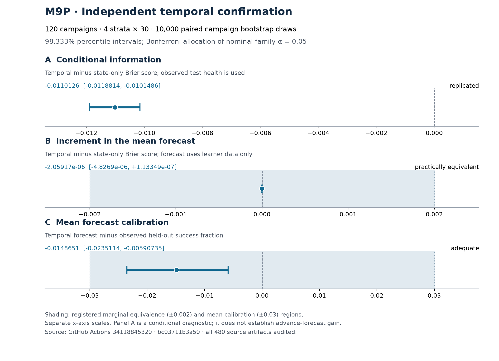

# M9P: independent temporal checkout confirmation

Status: complete. All 120 fresh campaigns and all five inferential gates passed.
The registered conditional temporal effect replicated; temporal and state-only
marginal forecasts were practically equivalent; the temporal mean signed error
was adequate within the registered ±0.03 region. Adequacy here permits a small
systematic bias: the signed-error interval is entirely below zero.

The experiment completed on 7 September 2026. This report and the reviewed
evidence snapshot were assembled on 8 September, after the automatic completed-run
audit. Neither historical M9N outcomes nor partial main batches supply these results.

## Execution and information boundary

The accepted first-attempt main run is
[34118845320](https://github.com/a-a-k/telemetry-availability-identification/actions/runs/34118845320),
at frozen commit `bc03711b3a50daa90be305986dd12769a2d8ef30`, started
2026-09-07T11:52:22Z and recorded completed-success at 15:25:08Z. All 124 jobs
succeeded, including all 120 acquisition jobs; no main attempt or cell was
replaced or omitted. The benchmark commit is
`8c47d47c9ac27710d2b2a153bcd53e483bffe66d`.

The [accepted no-fit preflight](M9P_NO_FIT_PREFLIGHT.md), run 34115470738,
is separate evidence of acquisition readiness. Its four cells contribute no
effectiveness observations. The initial preflight CSV normalization failure
and its byte-preservation repair remain recorded there.

The [frozen protocol](../M9P_TEMPORAL_CONFIRMATION_PROTOCOL.md) implements
2 placements × 2 failure laws × 30 repetitions for OpenTelemetry checkout.
Each campaign has 60 seconds of baseline and 900 seconds each of calibration
and test, using the mixed-operation driver at four requests per second.
The analysis retains seven methods, with `temporal_logit_midpoint` primary.
All probabilities and curve parameters are fitted afresh from the learner
artifacts. The calibration stable subset excludes the frozen alignment,
transition-guard and left-censoring cases; the evaluation uses the corresponding
test eligibility rule. This is not an all-traffic availability claim.

The candidate manifest contains all 840 method–campaign candidates. It records
no test outcomes, test health or raw traces staged during fitting, and no
post-test selection. Its artifact was uploaded at 15:23:37Z; the independent
access check at 15:24:02.164041Z verified that publication before starting any
evaluator download. Evaluation was generated at 15:24:31.273632Z. The candidate
seal SHA-256 is
`8389b5457730cdd7cefd88442401403e74f3a9eb2de088db6265196ae92e57d6`.

The configuration SHA-256 is
`b11965da68f02b97fc3dac7c6a162807779a205f4a95efa696a70283422944ec`;
the analysis implementation SHA-256 is
`f0a13fd4181a515efe95a887432b1d2ec2b03e79f717897f797b6fd88f977890`.
The completed-summary audit checks all ten readiness implementation locks
against the frozen Git objects. The runtime manifests retain their reported
`git.dirty=true`; that flag is not treated as a clean-tree attestation in place
of the explicit implementation and input locks.

## Registered gates

All five gates are true: complete campaign matrix, learner adequacy, fit
integrity, test adequacy, and interval sensitivity. The extrema below are copied
from the candidate and evaluation manifests; no favorable subset is selected.

| Check | Registered requirement | Observed extremum |
|---|---:|---:|
| Stable calibration checkout requests per campaign | ≥500 | Minimum 881 |
| One-path calibration requests | ≥100 | Minimum 131 |
| One-path calibration episodes | ≥8 | Minimum 24 |
| Early / late one-path calibration requests | ≥20 each | Minima 79 / 50 |
| Calibration age-interval width | ≤1.1 s | Maximum 1.025563955 s |
| Finite optimizer starts | All 8 | Minimum 8 |
| Converged optimizer starts | ≥1 | Minimum 6 |
| Equivalent-fit prediction range | ≤0.0001 | Maximum 0.000000214057 |
| Stable test checkout requests per campaign | ≥500 | Minimum 891 |
| Test age-interval width | ≤1.1 s | Maximum 1.027909040 s |
| Mean within-cell lower/midpoint/upper prediction span | ≤0.02 | 0.000133106263 |

## All three registered results

The paired bootstrap resamples campaigns within each of the four strata,
with 10,000 draws and equal stratum weights. Each reported percentile interval
has nominal level 98.33333333333333%, using a Bonferroni allocation of the 0.05
family error budget. This is the registered live-campaign inference procedure,
not an exact finite-sample joint coverage guarantee for dependent requests.
All numbers and classifications below come from the sealed evaluation manifest.

| Registered quantity | Estimate | Nominal 98.333% interval | Frozen classification |
|---|---:|---|---|
| Conditional temporal minus state-only Brier | −0.011012577339 | [−0.011881414332, −0.010148592690] | Replicated: upper endpoint <0 |
| Marginal temporal minus state-only Brier | −0.000002059172 | [−0.000004826896, +0.000000113349] | Practically equivalent: entire interval inside [−0.002, +0.002] |
| Temporal marginal signed error | −0.014865098855 | [−0.023511379660, −0.005907349760] | Adequate: entire interval inside [−0.03, +0.03] |

The temporal forecast averages 0.764570659148 against held-out success
0.779435758003: it underpredicts by 1.486510 percentage points. Its mean signed
error interval is approximately [−2.351138, −0.590735] percentage points.
The registered mean-bias criterion passes, although unbiasedness is not supported.
The mean absolute campaign error, 0.035662682045, is a different quantity and
does not inherit the ±0.03 mean signed-error decision.

Conditional scoring uses observed test health and age. Its improvement supports
the temporal response association under this design; it does not establish an
advance-forecast gain. For the learner-only marginal forecast, the complete
interval is far inside the registered practical-equivalence region. This is
positive evidence of equivalence at that tolerance, rather than merely a failure
to reject equality. It is not evidence that every temporal effect is exactly zero.

## Descriptive methods and matched controls

All seven methods are retained. The common observed test success mean is
0.779435758003. These are campaign-aggregated descriptive summaries, not extra
inferential contrasts or a post-result method-selection rule. Lower and upper
refer to alternative age representations, not probability confidence bounds.

| Method | Mean forecast | Mean signed error | Mean absolute error | Marginal Brier | Conditional Brier |
|---|---:|---:|---:|---:|---:|
| State-only | 0.764531333 | −0.014904425 | 0.035694248 | 0.170951438 | 0.052684237 |
| Temporal lower | 0.764525953 | −0.014909805 | 0.035690218 | 0.170951570 | 0.041683711 |
| Temporal midpoint (primary) | 0.764570659 | −0.014865099 | 0.035662682 | 0.170949379 | 0.041671660 |
| Temporal upper | 0.764658711 | −0.014777047 | 0.035629986 | 0.170946399 | 0.041636803 |
| Source 500 ms failover | 0.947237075 | +0.167801317 | 0.167801317 | 0.199800345 | 0.186633897 |
| Matched stable endpoint | 0.775696016 | −0.003739742 | 0.032570189 | 0.170641916 | 0.170641916 |
| All-calibration endpoint | 0.732750486 | −0.046685272 | 0.052215597 | 0.172662392 | 0.172662392 |

The matched stable endpoint uses the same calibration stable subset and the
Jeffreys estimate `(successes + 0.5)/(requests + 1)`, without an extra baseline
response-factor multiplication. It has a smaller observed mean absolute error
and marginal Brier than the temporal primary. No registered superiority claim
against that endpoint is made. The all-calibration endpoint answers a different
training-population question, so its larger observed error cannot replace the
matched comparison. Conditional method scores use different conditioning inputs;
the inferential conditional contrast is the frozen temporal/state-only pair.

## Information and computing costs

The main run used 69.051389 summed job runner-hours, including the final audit's
28 seconds. The remote main audit reports 69.043611 hours and explicitly excludes
its own still-running job; the completed summary reconciles that distinction.
The design budget was 62 nominal acquisition runner-hours. These are summed job
durations, not wall-clock duration, monetary charges or instrumented monitoring
overhead.

The 120 source bundles contain 28,935,052,357 bytes across source files, including
27,519,915,940 native-trace bytes, 365,514,414 request bytes and 148,190,300 health
bytes. The raw-source artifacts occupy 2,277,536,262 compressed bytes. Native
qualification totals 526.249751 seconds. The learner has 460,800 mixed-operation
request rows and 108,031 calibration health ticks across all campaigns.

| Method | Total fit / estimation seconds | Median per campaign, seconds |
|---|---:|---:|
| State-only | 7.946905 | 0.064841 |
| Temporal lower | 28.184776 | 0.231834 |
| Temporal midpoint | 29.244003 | 0.241150 |
| Temporal upper | 30.085589 | 0.244140 |
| Source 500 ms failover | 0.020667 | 0.000171 |
| Matched stable endpoint | 0.004100 | 0.000034 |
| All-calibration endpoint | 0.072996 | 0.000616 |

Each method uses the same actual shared request files, totaling 111,673,549 bytes.
All except the all-calibration endpoint additionally use 19,738,660 health bytes;
the matched stable endpoint needs health to select the common subset. The
all-calibration endpoint's minimal outcome projection is 3,786,536 bytes, but an
isolated endpoint I/O time was not measured. Native-trace model-input bytes are
zero for all seven methods; the trace collection and qualification above still
occurred. Shared parsing and episode-construction costs are retained separately
and must not be added seven times. Total candidate generation took 131.629642
seconds and evaluation 24.237015 seconds. These measurements establish no lower
end-to-end cost relative to PMX and do not measure agent or engineering effort.

## Retained evidence and verification

The automatic [completed-summary audit](../evidence/m9p-34118845320/completed-summary-audit.json)
passed at 2026-09-07T15:25:34.660235Z. It verified all 124 job identities,
480 source and five summary artifact records, ten frozen implementation locks,
11 sealed summary files, all 840 candidate/score pairs, and all 120 adequacy rows.
Only the five summary ZIPs were downloaded and checked byte-for-byte against
their API lengths and SHA-256 digests. No native, learner or evaluator bundle
was downloaded locally, and no estimate, interval or decision was recomputed.
Source artifact provenance and retention were checked through the API and
remote audits; this does not claim that every raw ZIP was rehashed locally.

All five summary archives expire at 2026-12-06T11:52:23Z. Their names share suffix
`-34118845320-a1`.

| Prefix | Artifact ID | ZIP bytes | SHA-256 |
|---|---:|---:|---|
| m9p-readiness | 10017363893 | 3,752 | `aa4e0d0ebdd6ec01bfc61ca693ea7858ce8cc5260353df820ed0def58b26414c` |
| m9p-candidates | 10024765443 | 91,673 | `7b06224b58d7c3db3c2436303320d020cd2b307d3c07d7762348b3ef7d88830b` |
| m9p-evaluation | 10024795288 | 76,083 | `2de89c6b92e1a4774dacb2758e6ee1cc6ba04a522df1ebf267aa8a685fd4b386` |
| m9p-evaluator-access | 10024795888 | 674 | `7a97c6c4a51283e1527c915f5b3bd0d53dfa238bb918d29ede82ecf87e41f325` |
| m9p-main-final-audit | 10024812736 | 42,802 | `de668eb43d033cc6a24eee690b7c44adcb9356cb445c96da5d735b07e6e18b06` |

The [reviewed snapshot](../evidence/m9p-34118845320/README.md) retains the exact
unpacked summaries, seals, campaign-level generated tables, full artifact locks
and completed audit. Its local Git attributes preserve their bytes. The figure
was rendered from the three exact manifests using the previously prepared
[reporting method](../M9P_REPORTING_METHOD.md), without fitting or rescoring.
[PDF](../figures/m9p-confirmation/m9p-confirmation.pdf),
[SVG](../figures/m9p-confirmation/m9p-confirmation.svg) and
[figure provenance](../figures/m9p-confirmation/figure-provenance.json) accompany
the PNG. The actual figure was inspected after rendering.

## Interpretation for the article

M9P independently confirms a useful temporal conditional-response model for the
specified checkout setting, while bounding its extra marginal value relative
to state-only prediction inside the registered equivalence region. Mean forecast
bias is small enough for the registered criterion, with measurable underprediction.
The [calibration identity](../M9P_CALIBRATION_IDENTITY.md) explains why conditional
improvement and nearly identical calibration-weighted means can coexist under
its stated conditions. It was derived before the confirmation outcomes and is
not substituted for these independent intervals.

The temporal curve was explicitly specified after source and retained-data
diagnosis. It was not automatically discovered by the signature compiler.
Confirming it neither validates the original static route law nor identifies
every primitive cause, each call's backend or a literal router-switching time.
The [target-exposure note](../TARGET_EXPOSURE_AND_MEAN_FORECASTS.md) concerns a
separate transport question; M9P did not test a new target exposure distribution.

The supported claim is therefore a distinction between model identification,
conditional mechanism information and adequacy of a specified mean forecast.
It is not automatic discovery of the smallest adequate live model, universal
accuracy, or predictive superiority over matched endpoint estimation or PMX.
The [M9Q application census](M9Q_PMX_APPLICATION_CENSUS.md) and
[M9R composition control](M9R_PMX_INCLUSIVE_ERROR_COMPOSITION.md) retain the
unresolved independent PMX request mapping and solver correspondence. Those
limits are not unfavorable PMX forecast scores. A final article claim must
respect these boundaries and the restricted mathematical assumptions.
